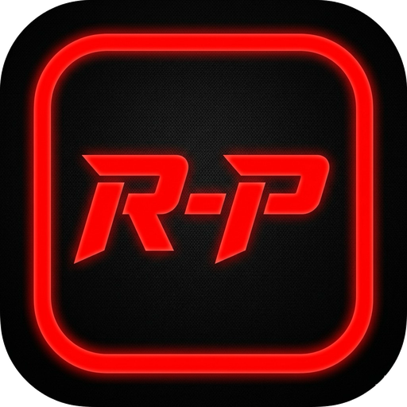

<p align="center">
  
</p>

# Rugdraiger Play

Reproductor de música local con versión **web** y app **Flutter**.

## Web

```bash
cd web
npm install
npm run dev
```

Abre `http://localhost:5173` en Chrome.

### PWA + Android

La app web es una **PWA** lista para empaquetar con [PWA Builder Studio](https://marketplace.visualstudio.com/items?itemName=PWABuilder.pwa-studio).

Guía completa: [`android-twa/ANDROID.md`](android-twa/ANDROID.md)

### Publicado en GitHub Pages

https://RUGDRAIGER.github.io/rugdraiger_play/

Para actualizar la web publicada:

```bash
cd web
VITE_BASE_PATH=/rugdraiger_play/ npm run build
cd dist && git init -b gh-pages && git add -A && git commit -m "Deploy"
git push -f origin gh-pages
```

## Flutter

```bash
cd rugdraiger_player
flutter pub get
flutter run
```
